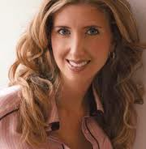
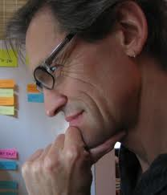
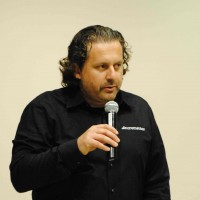

<a href="./agile-culture-conf.html">REGISTER</a> &nbsp;&nbsp;<a href="./acc_sessions.html">SESSIONS</a> &nbsp;&nbsp;SPEAKERS &nbsp;&nbsp;<a href="./acc_program.html">PROGRAM</a>
========
 
 Harrison Owen (keynote speaker), creator of <a href="http://www.openspaceworld.com/brief_history.htm">Open Space</a>

Harrison Owen is an author, consultant and photographer. For forty years he has explored the world and himself seeking the ways and means towards a deeper understanding of who we all are and how we may live productively with meaning and purpose. His journey has always been interesting, sometimes exciting, and on more than one occasion -- deeply rewarding 
 
Traci Fenton, founder of <a href="http://www.worldblu.com/">WorldBlu</a>

WorldBlu promotes freedom at work throughout the world with seminars, conference events and certifications. Traci is the founder of WorldBlu and the author of the upcoming book FREEDOM AT WORK, chronicling the story of WorldBlu and WorldBlu- certified organizations. 
 
Eric Raymond, Open Source Leader, Author of How to Be a Hacker, The Cathedral and the Bazaar & The Art of Unix Programming<a href="http://www.catb.org/~esr">More…</a>

Eric S. Raymond is an observer-participant anthropologist in the Internet hacker culture. His research has helped explain the decentralized open-source model of software development that has proven so effective in the evolution of the Internet. Mr. Raymond is also a science fiction fan, a musician, an activist for the First and Second Amendments, and a martial artist with a Black Belt in Tae Kwon Do. His home page is at <a href="http://www.catb.org/~esr">http://www.catb.org/~esr</a>.

Jim McCarthy, co-author of <a href="http://www.mccarthyshow.com/online/">The Core Protocols</a> and Software for Your Head.

Jim led the creation one of the great Microsoft teams, the Visual C++ team. Jim wrote Dynamics of Software Development from Microsoft Press (1995, 2006). His approach and observations formed the basis of Microsoft Solutions Framework and were a catalyst for and a progenitor of the Extreme and Agile programming movements. 
Jim partners with his wife, Michele McCarthy, to run McCarthy Technologies, Inc., which provides technology, training and consulting that enables organizations and teams to consistently generate the greatest possible results. The key to these results is an innovative, proprietary technology called "The Core". It encapsulates and makes accessible the best interpersonal collaboration technology currently available and has been thoroughly researched, tested, and applied over the past 15 years. Just as Jim's earlier approaches contributed to Microsoft's successful culture, and ultimately helped give rise to the XP and Agile movements, his current research into The Core is poised to help a new generation of organizations achieve their highest potential. 
 

Michele McCarthy, co-wrote "Software For Your Head," 2001, Addison-Wesley, and the 2006 edition of "Dynamics of Software Development," by Microsoft Press. See more at the <a href="http://www.mccarthyshow.com">McCarthy Show</a>.

Beginning in 1990, Michele worked at Microsoft as a program manager on five projects, establishing a reputation for shipping on time. Jim McCarthy met Michele and encouraged her to move to the Visual C++ group where she began innovating in the area of team dynamics. While at Microsoft, Michele reached many of the insights that led she and Jim to leave Microsoft and create McCarthy Technologies, Inc. She is responsible for the development of many of the team formation concepts McCarthy Technologies practices and teaches today. 
Michele has brought her team efficiency skills to bear on the McCarthy BootCamps and the subsequent development of The Core Protocols. She is currently the primary instructor at McCarthy BootCamps around the world, the primary consultant to McCarthy Technologies' clients, and co-hosts The McCarthy Show podcast with Jim. Her passion is transforming groups of executives into true teams and advising high potential leaders. 
 

Dan Mezick, organizer for <a href="http://newtechusa.net/user-groups/ma/">Agile Boston and author of The Culture Game</a>

He teaches business agility,  guiding  and consulting to executives and their organizations in self-management techniques. Dan is an expert in organizational learning techniques. Dan delivers Agile courses, seminars and consulting to organizations of all sizes in the USA.
 
He is an invited speaker to conferences such as the prestigious Self-Management Symposium. His clients include Zappos Insights, Orpheus Orchestra and some of the most agile organizations in the New England region and the USA. 
 

Tobias Mayer, Agile Agitator, anarchist, experimenter, and reformer; see <a href="http://agilethinking.net/">AgileThinking.net</a>

Tobias is a genuine thought leader in the Agile software development community. He is the consummate "culture hacker". Outspoken and convicted, he delivers Agile learning and consulting in the US and Europe.
 
He is a facilitator, educator and independent consultant with a successful record of guiding both major companies and start-ups to more agile, self-organized and compassionate ways of working. A self-educated high school dropout with a background in software development, community education, personal development, technical theatre, creative writing, and graphic design, Tobias brings an unusual mix of ideas and experiences to bear. His workshops and presentations are invitations to explore rather than expert opinion, with the intent always to disturb the equilibrium and inspire different ways of thinking. 

Bob Gower, Agile Coach, <a href="http://www.rallydev.com">Rally Software</a>

Bob Gower is passionate about innovative products and the people who make them. An author, speaker, and consultant, Bob has spent more than 15 years leading complex, creative projects. He helps companies leverage the power of their people, and create truly collaborative cultures that improve product quality and employee morale. Bob is currently an Agile coach for Rally Software, where he specializes in enterprise-level Agile transformations. When not traveling, Bob lives in New York City.
 

Drew Marshall, Principal, <a href="http://www.thinkprimed.com">Primed Associates, LLC</a>

Andrew C. Marshall [Drew] is the Principal of Primed Associates, LLC, an innovation consultancy. He lives in central NJ and works with clients across the USA and around the world. Prior to founding Primed Associates, LLC, Drew spent ten years with Princeton-based management consulting firm Kepner-Tregoe where he rose to become a Partner and the Chief Innovation Officer and visited the Pyramids of Meroë. He is a co-host of the weekly innovation-focused Twitter chat, #innochat, the founder, host and producer of Ignite Princeton and a contributor to the Innovation Excellence and Collaborative Innovation blogs. He is also providing support for the implementation of the Design Thinking for Scholars model with the Network of Leadership Scholars (an interest group within the Academy of Management). He is also a passionate cook - if you enter his home, prepare to be fed.
 

Trevor Lalish-Menagh, Senior Web Developer, <a href="http://www.comcast.com">Comcast Interactive Media</a>

Trevor Lalish-Menagh is a senior web developer at Comcast Interactive Media where he spearheaded the front-end unit testing initiative, and co-created EnvJasmine (github.com/trevmex/EnvJasmine), a headless self-contained framework for testing front-end code in a continuous integration environment. He has been a part of the Philly tech scene for the last three years and has been involved in organizing Philly.rb, Philly Lambda, Functional Fall, and Philly ETE. He has spoken at Philly BarCamp, Ruby DCamp, JSConf, and various technology user groups around Philadelphia.
 

Kathryn Alexander, Culture Coach

Kathryn Alexander is a culture coach / futurist who shows business leaders how to develop and sustain authentic, creative cultures. Kathryn designed the Birds of a Feather™ and Strategic Values™ assessments to help executives better understand the hidden dynamics in culture.

Kathryn: a relationship wizard, seminar leader and, Living from the Heart of Nature: Why Sustainable Values Matter author, is on a quest to guide values-driven leaders to release the wisdom of nature into their organizations. Whether they seek to enter the first stage of sustainability through a wise use of resources, or are moving up and down the value chain in the second stage, or have progressed to the third stage of actually healing the Earth, Kathryn’s insight and expertise helps them create the resilience they need.

Selected as Organization of the Year in 2012 by the Boulder Business Women and seen as a Woman to Watch in Sustainable Business by the Boulder Weekly, she works with Fortune 50 and start ups.

 

Joe Krebs, Coach/Trainer/Consultant, <a href="http://www.incrementor.com">Incrementor</a>

Jochen (Joe) Krebs is an agile coach, trainer, consultant and most important a practitioner. Since 2005, Joe coaches and delivers trainings and workshops to organizations through Incrementor. He helps teams and enterprises with the successful adoption of agile processes such as Scrum, XP, Lean/Kanban and other iterative-incremental processes. His programs are characterized by a unique blend of knowledge transfer with hands-on work. Back in 2008, Joe pioneered “Agile Portfolio Management” by publishing the first book about this topic. Today, many organizations around the globe seeking advice in this topic to benefit from the beauty agile processes provide. He also published numerous articles in magazines about agile practices and processes. When time permits, he speaks at conferences, private client events or presents at other local user group meetings. You will find more information about Joe here or connect with him @jochenkrebs. 
 

Michael Sahota, Agile Coach, <a href="http://agilitrix.com">Agilitrix</a>

As the senior principal of Agilitrix, his mission is to make a difference in the lives of the people and the companies he works with. As a thought leader, he uses innovative approaches, and a wide set of tools, though his main strength is the energy and passion he brings as a change artist to help clients realize their goals. Sure the goal is to get better, but we can do that and put a smile on everyone’s face.
 

André Dhondt, Executive/Agile Coach, Agile Philly Coordinator, <a href="http://www.rallydev.com">Rally Software</a>

For over a decade, André has led agile adoptions, providing guidance to teams and organizations seeking shorter development cycles, higher quality, and more effective discovery of customer value. Playing various roles, from developer, manager, product owner and scrum master, he's done everything from hiring and building teams in startup environments to coaching teams for an organization with over 100k employees. Some of his teams have seen 50% reduced cycle time, practically bug-free code with daily deployments, and improved employee morale. He's also active in the community, providing leadership to groups such as: [Agile Philly](http://www.agilephilly.com) and [Technically Philly Groups](/index.html). 
 
 

Ozioma Egwuonwu, Columbia University & Head of <a href="http://burnbright-lifeworks.com/">BurnBright Lifeworks</a>

Considered a leader in the emerging discipline of cultural strategy, Ozioma Egwuonwu has solved complex production, strategic and creative problems for a diverse array of clients across a number of product and service categories. 
Ms. Egwuonwu is Head of CULTURA, a practice across RAPP’s global network that helps clients "find their role" in culture by uncovering insights, fueling innovation and crafting brand experiences rooted in culture.
In 2006 at the age of 25, Ozioma founded BurnBright Lifeworks, Inc. a consultancy that specializes in igniting human potential within the arena of personal, professional and cultural transformation http://burnbright-lifeworks.com/
Ozioma has written for numerous publications, been featured on NBC, spoken at SXW Interactive festival and served as an adjunct professor at Marymount College of Fordham University in their theatre and media department
Ms. Egwuonwu currently teaches Developing and Implementing Ideas, a masters levels course at Columbia University.
 
 
