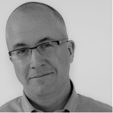
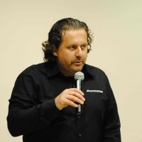


<a href="./agile-culture-conf.html">REGISTER</a> &nbsp;&nbsp;SESSIONS &nbsp;&nbsp;<a href="./acc_bios.html">SPEAKERS</a> &nbsp;&nbsp;<a href="./acc_program.html">PROGRAM</a>
========
 
 

Kicking the Habit: Creating lasting cultural change, one pattern at a time.
==============
Bob Gower, Agile Coach, <a href="http://www.rallydev.com">Rally Software</a>

Culture is a collection of individual and organizational behaviors—most of them habitual. When shifting the behavior of a system we work against powerfully ingrained patterns. These can be incredibly hard to change—ask anyone who's ever tried to quit smoking or lose weight. 

The good news is that there's an emerging science behind habit change. If you understand the science you can bring conscious and deliberate action to even the most ingrained habit can shift—and sometimes quite rapidly.

In this talk I'll cover the science and art of organizational change and illustrate with examples from my own life and practice leaving you with a solid set of tools for shifting the patterns in your own organization. 
 

How hidden beliefs and tacit values impact culture
================
Kathryn Alexander, Culture Coach

In this experiential session participants will explore: their own belief and value systems and, in discussion, examine the impact these have on their underlying preferences for order, the kinds of ethics preferred, and leadership style they find most comfortable. Then we will explore how to work with various types of leaders to create a flexible and authentic culture.
The proprietary assessments used in this session have been used for over 15 years, with a new addition recently added to address the shifting needs of companies moving into sustainable business practices. The Birds of a Feather™ assessment provides insight into world-views that impact leadership and the Strategic Values™ assessment opens a window into three systems of values that impact leadership style and culture.
Some time is needed to take these assessments and score them using paper and pen or they can be done beforehand (by arrangement) online.
 

Project RAPPCulture: Illuminating Cultural Paradigms and Sparking Cultural Evolution
===================
Ozioma Egwuonwu, Columbia University & Head of <a href="http://burnbright-lifeworks.com/">BurnBright Lifeworks</a>
 
An organization’s culture is built on values, beliefs and basic assumptions that manifest themselves in the smallest of details. Companies like RAPP believe that an investment in the co-creation of agile culture with its employees inevitably creates an optimal work environment based on shared value.

In October 2011, RAPP conducted a cultural experiment using a series of progressive techniques rooted in the transformational methodologies of Ozioma Egwuonwu, founder of BurnBright Lifeworks, Inc.  

The aim of the RAPPCulture project was to diagnose the cultural paradigm of the agency, explore challenges to employee engagement, and spark a shift in organizational culture.

As participants across 4 offices were guided through deeper states of cultural awareness, cultural dynamics were explored. The RAPPculture study continues to play a vital role in the evolution of company culture, as it yielded rich insights and instigated a strategy for tailored cultural change. 

This presentation will share the case study, research methods/design and key learnings for engaging employees in organizational transformation from the bottom up/inside out via the use of collaborative innovation & technology. 

 

Holding ACEs
============
Drew Marshall, Principal, <a href="http://www.thinkprimed.com">Primed Associates, LLC</a>

In this new world, speed, agility, and most important: results will ultimately be achieved through the quality of the relationships between people. In order to build those high-quality relationships, we must define and support how they are identified, formed and managed over time. The concept behind our approach is called “Holding ACEs”. An ACE relationship is formed when two or more people choose to enter into an agreement where one person or group commits to meeting the expectations of another. This agreement is a mutually binding and monitored accountability. It is documented and made visible to everyone involved (and may be shared with anyone across the organization.) The sum of all ACEs 'held' by two people, a group or multiple groups is a measure of their:
 * intent (what are we trying to achieve?),
 * focus (who is doing what?), 
 * productivity (what are we achieving?) and, 
 * capacity (what else might we achieve?).

<be clear="all" />

From Scrum to Kanban: An Experiment in Freedom
================
Trevor Lalish-Menagh, Senior Web Developer, <a href="http://www.comcast.com">Comcast Interactive Media</a>

Our teams have embraced the agile spirit for years, and what that
means to us is flexibility. Flexibility in management, flexibility in
employees, and flexibility to change. Earlier this year, the team I am
on decided to experiment with a Kanban board and work in progress
limits, bucking the trend of a scrum-based approach. Although we had
bumps in the road, through frequent retrospectives and a willingness
to change we found a system that works for us. I will share our
experience with you in the hope that you can foster the agile spirit
in your workplace as well.
 

The Agile Culture with or without the PMO
================
Joe Krebs, Coach/Trainer/Consultant, <a href="http://www.incrementor.com">Incrementor</a>

A Project Management Office (PMO) sets the culture of a project organization with procedures, guidelines, practices and project review. Transitioning to agile projects with truly empowered and self-organized teams, the game for enterprise-wide regulations has changed. Let’s talk about an effective PMO, serving the teams and leading real change.
 

