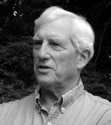
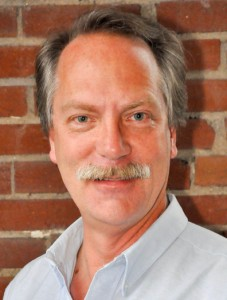
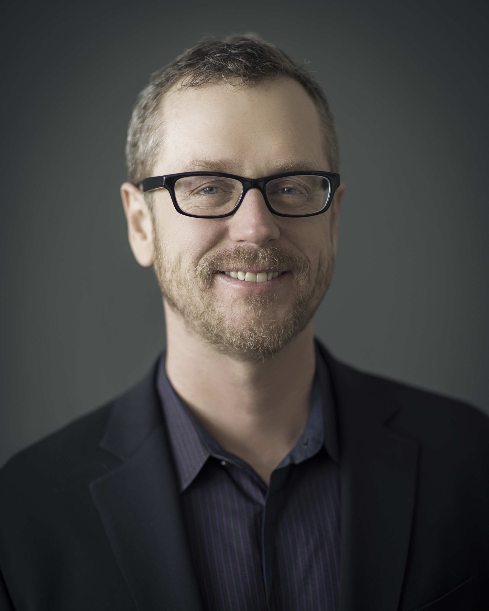
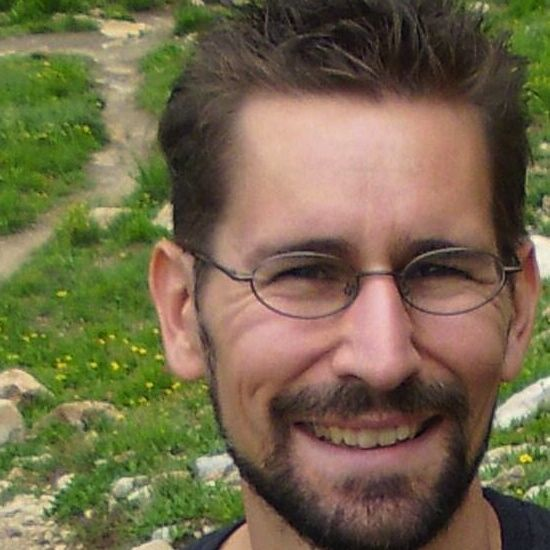


<a href="./agile-culture-conf.html">REGISTER</a> &nbsp;&nbsp;SESSIONS &nbsp;&nbsp;<a href="./acc_bios.html">SPEAKERS</a> &nbsp;&nbsp;<a href="./acc_program.html">PROGRAM</a>
========
 
 Harrison Owen (keynote speaker), creator of <a href="http://www.openspaceworld.com/brief_history.htm">Open Space</a>

 
Traci Fenton, founder of <a href="http://www.worldblu.com/">WorldBlu</a>

Jim McCarthy, co-author of <a href="http://www.mccarthyshow.com/online/">The Core Protocols</a> and Software for Your Head.

 
 

Michele McCarthy, co-wrote "Software For Your Head," 2001, Addison-Wesley, and the 2006 edition of "Dynamics of Software Development," by Microsoft Press. See more at the <a href="http://www.mccarthyshow.com">McCarthy Show</a>.

 
 

Dan Mezick, organizer for <a href="http://newtechusa.net/user-groups/ma/">Agile Boston and author of The Culture Game</a>

Tobias Mayer, Agile Agitator, anarchist, experimenter, and reformer; see <a href="http://agilethinking.net/">AgileThinking.net</a>

 

Kicking the Habit: Creating lasting cultural change, one pattern at a time.
==============
Bob Gower, Agile Coach <a href="http://www.rallydev.com">Rally Software</a>

Culture is a collection of individual and organizational behaviors—most of them habitual. When shifting the behavior of a system we work against powerfully ingrained patterns. These can be incredibly hard to change—ask anyone who's ever tried to quit smoking or lose weight. 

The good news is that there's an emerging science behind habit change. If you understand the science you can bring conscious and deliberate action to even the most ingrained habit can shift—and sometimes quite rapidly.

In this talk I'll cover the science and art of organizational change and illustrate with examples from my own life and practice leaving you with a solid set of tools for shifting the patterns in your own organization. 
 

André Dhondt, Executive/Agile Coach, Agile Philly Coordinator, <a href="http://www.rallydev.com">Rally Software</a>

 
 
Project RAPPCulture: Illuminating Cultural Paradigms and Sparking Cultural Evolution
===================
Ozioma Egwuonwu, Columbia University & Head of <a href="http://burnbright-lifeworks.com/">BurnBright Lifeworks</a>
 
An organization’s culture is built on values, beliefs and basic assumptions that manifest themselves in the smallest of details. Companies like RAPP believe that an investment in the co-creation of agile culture with its employees inevitably creates an optimal work environment based on shared value.

In October 2011, RAPP conducted a cultural experiment using a series of progressive techniques rooted in the transformational methodologies of Ozioma Egwuonwu, founder of BurnBright Lifeworks, Inc.  

The aim of the RAPPCulture project was to diagnose the cultural paradigm of the agency, explore challenges to employee engagement, and spark a shift in organizational culture.

As participants across 4 offices were guided through deeper states of cultural awareness, cultural dynamics were explored. The RAPPculture study continues to play a vital role in the evolution of company culture, as it yielded rich insights and instigated a strategy for tailored cultural change. 

This presentation will share the case study, research methods/design and key learnings for engaging employees in organizational transformation from the bottom up/inside out via the use of collaborative innovation & technology. 

 

Holding ACEs
============
Drew Marshall, Principal <a href="http://www.thinkprimed.com">Primed Associates, LLC</a>
In this new world, speed, agility, and most important: results will ultimately be achieved through the quality of the relationships between people. In order to build those high-quality relationships, we must define and support how they are identified, formed and managed over time. The concept behind our approach is called “Holding ACEs”. An ACE relationship is formed when two or more people choose to enter into an agreement where one person or group commits to meeting the expectations of another. This agreement is a mutually binding and monitored accountability. It is documented and made visible to everyone involved (and may be shared with anyone across the organization.) The sum of all ACEs 'held' by two people, a group or multiple groups is a measure of their:
o	intent (what are we trying to achieve?),
o	focus (who is doing what?), 
o	productivity (what are we achieving?) and, 
o	capacity (what else might we achieve?).

