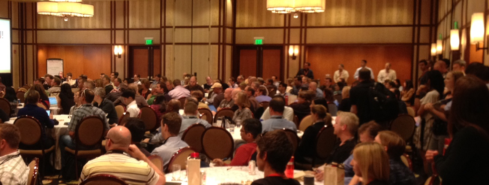
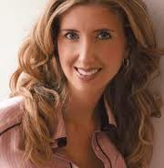
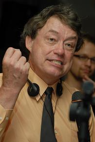
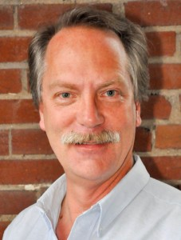

Boost productivity, market/product fit, creativity and quality all while increasing employee morale! If you believe that organizational culture is the key to management, this is the conference for you! At this event, executives, directors, and managers will all find tips & tricks to improve corporate culture, starting day one!
 
REGISTER
========
 
Wednesday, Sept 12, 2012 8am-7pm

<a href="http://www.aceconferencecenter.com/index.php">800 Ridge Pike, Lafayette Hill, PA</a>

<a href="https://www.brownpapertickets.com/event/249645">SIGN UP HERE</a>
 

SPEAKERS
========
 
 Harrison Owen, creator of <a href="http://www.openspaceworld.com/brief_history.htm">Open Space</a>

Harrison Owen is an author, consultant and photographer. For forty years he has explored the world and himself seeking the ways and means towards a deeper understanding of who we all are and how we may live productively with meaning and purpose. His journey has always been interesting, sometimes exciting, and on more than one occasion -- deeply rewarding 
 
Traci Fenton, founder of <a href="http://www.worldblu.com/">WorldBlu</a>

WorldBlu promotes freedom at work throughout the world with seminars, conference events and certifications. Traci is the founder of WorldBlu and the author of the upcoming book FREEDOM AT WORK, chronicling the story of WorldBlu and WorldBlu- certified organizations. 
 

Jim McCarthy, co-author of <a href="http://www.mccarthyshow.com/online/">The Core Protocols</a> and Software for Your Head.

Jim led the creation one of the great Microsoft teams, the Visual C++ team. Jim wrote Dynamics of Software Development from Microsoft Press (1995, 2006). His approach and observations formed the basis of Microsoft Solutions Framework and were a catalyst for and a progenitor of the Extreme and Agile programming movements. 
Jim partners with his wife, Michele McCarthy, to run McCarthy Technologies, Inc., which provides technology, training and consulting that enables organizations and teams to consistently generate the greatest possible results. The key to these results is an innovative, proprietary technology called "The Core". It encapsulates and makes accessible the best interpersonal collaboration technology currently available and has been thoroughly researched, tested, and applied over the past 15 years. Just as Jim's earlier approaches contributed to Microsoft's successful culture, and ultimately helped give rise to the XP and Agile movements, his current research into The Core is poised to help a new generation of organizations achieve their highest potential. 
 

Michele McCarthy, co-wrote "Software For Your Head," 2001, Addison-Wesley, and the 2006 edition of "Dynamics of Software Development," by Microsoft Press. See more at the <a href="http://www.mccarthyshow.com">McCarthy Show</a>.

Beginning in 1990, Michele worked at Microsoft as a program manager on five projects, establishing a reputation for shipping on time. Jim McCarthy met Michele and encouraged her to move to the Visual C++ group where she began innovating in the area of team dynamics. While at Microsoft, Michele reached many of the insights that led she and Jim to leave Microsoft and create McCarthy Technologies, Inc. She is responsible for the development of many of the team formation concepts McCarthy Technologies practices and teaches today. 
Michele has brought her team efficiency skills to bear on the McCarthy BootCamps and the subsequent development of The Core Protocols. She is currently the primary instructor at McCarthy BootCamps around the world, the primary consultant to McCarthy Technologies' clients, and co-hosts The McCarthy Show podcast with Jim. Her passion is transforming groups of executives into true teams and advising high potential leaders. 
 

Dan Mezick, organizer for <a href="http://newtechusa.net/user-groups/ma/">Agile Boston and author of The Culture Game</a>

He teaches business agility,  guiding  and consulting to executives and their organizations in self-management techniques. Dan is an expert in organizational learning techniques. Dan delivers Agile courses, seminars and consulting to organizations of all sizes in the USA.
 
He is an invited speaker to conferences such as the prestigious Self-Management Symposium. His clients include Zappos Insights, Orpheus Orchestra and some of the most agile organizations in the New England region and the USA. 
 

Tobias Mayer, Agile Agitator, anarchist, experimenter, and reformer; see <a href="http://agilethinking.net/">AgileThinking.net</a>

Tobias is a genuine thought leader in the Agile software development community. He is the consummate "culture hacker". Outspoken and convicted, he delivers Agile learning and consulting in the US and Europe.
 
He is a facilitator, educator and independent consultant with a successful record of guiding both major companies and start-ups to more agile, self-organized and compassionate ways of working. A self-educated high school dropout with a background in software development, community education, personal development, technical theatre, creative writing, and graphic design, Tobias brings an unusual mix of ideas and experiences to bear. His workshops and presentations are invitations to explore rather than expert opinion, with the intent always to disturb the equilibrium and inspire different ways of thinking. 
 

*more to be announced soon!*
 
 

Freedom at Work, brought to you by revolutionary-day Cities of Freedom: Philadelphia & Boston
==============

Speakers will be ferried from Philadelphia to Boston on September 14, where we'll pick up additional Agile Culture experts in NYC and CT.
  
Friday, September 14, in Boston MA

Learn MORE about the <a href="http://newtechusa.net/culture-con/">Boston event and Agile Boston here.</a>