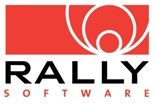
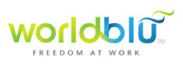


REGISTER &nbsp;&nbsp;<a href="./acc_sessions.html">SESSIONS</a>&nbsp;&nbsp; <a href="./acc_bios.html">SPEAKERS</a>&nbsp;&nbsp; <a href="./acc_program.html">PROGRAM</a>
=============

*management jolts for the 21st century*
=============
Boost productivity, market/product fit, creativity and quality all while increasing employee morale! If you believe that organizational culture is the key to management, this is the conference for you! At this event, executives, directors, and managers will all find tips & tricks to improve corporate culture, starting day one!
 
REGISTER
========
 
Wednesday, Sept 12, 2012 8am-7pm

<a href="http://www.aceconferencecenter.com/index.php">800 Ridge Pike, Lafayette Hill, PA</a>

<a href="https://www.brownpapertickets.com/event/249645">SIGN UP HERE</a>
 

Freedom at Work, brought to you by revolutionary-day Cities of Freedom: Philadelphia & Boston
==============

PHILLY: Wednesday, September 12
BOSTON: Friday, September 14

Learn MORE about the <a href="http://newtechusa.net/culture-con/">Boston event and Agile Boston here.</a>

SPONSORS
========
[Prospectus](/agile-culture-conf-sponsors.html) 
&nbsp;&nbsp;
&nbsp;&nbsp;
&nbsp;&nbsp;
&nbsp;&nbsp;
&nbsp;&nbsp;

