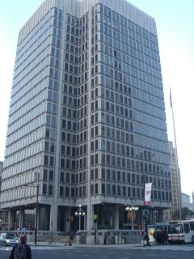
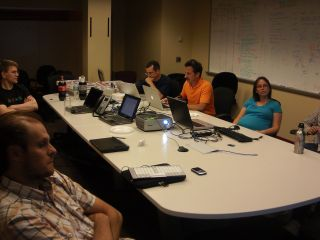

## Is your name "TPG" or "Technically Philly Groups"?

Officially, we're "Technically Philly Groups," but the bank will cash checks
written to "TPG," as well.

## What is the relationship between Technically Philly and TPG?

[Technically Philly][] has graciously allowed us to piggyback on their good
name. However, TPG is a completely separate entity. "Technically Philly Groups"
is the name of our Pennsylvania non-profit corporation; it is _not_ a
subsidiary or a related business unit of Technically Media, Inc., which runs
the Technically Philly web site.

## Are my contributions to TPG tax-deductible?

No. While Technically Philly Groups is a non-profit company, it is _not_ yet
a 501(c)(3). Most companies that give us money categorize the donation as
"Advertising and Promotion," rather than "Charitable Contribution."

## Who runs TPG?

[André Dhondt][] is the driving force behind the creation of TPG. However, many
others are involved in setting the group's direction and working behind the
scenes to make things happen.

## Is the City of Philadelphia officially involved?

Yes. TPG has the attention of the Mayor's office. Through representatives
from the City, TPG has access to additional resources, including meeting
space in the City's Municipal Services Building.

[Technically Philly]: http://technicallyphilly.com/
[André Dhondt]: http://www.about.me/adhondt

## How can I or my group get involved?

See our [Contacts](/contact.html) page.

## How can TPG help my user group?

In various ways, including:

* **Facilities**. Through an agreement with the City of Philadelphia, TPG
  has access to rooms in the Municipal Services Building, at Broad and Arch
  Sts.
* **Equipment**. TPG has projectors to lend.
* **Food**. TPG member groups often meet at the same time, in the Municipal
  Services Building, in different rooms on the 16th floor. These joint meeting
  help to promote cross-pollination and networking. TPG sponsors generally
  take care of providing pizza and drinks for these meetings.
* **Promotion**. TPG can help promote your group to the wider technology
  audience in the Philadelphia area.

## What's the answer to life, the universe, and everything?

Why, 42. (Of course.)
